# SecureChat Architecture

Generated automatically by `./gradlew architectureReport`.

## Overview

| Metric | Count |
|---|---:|
| Modules | 35 |
| Module groups | 12 |
| Project dependencies | 101 |
| Kotlin files | 934 |
| Test Kotlin files | 83 |
| Resource files | 60 |

## Module groups

### androidApp

- [**androidApp** (`:androidApp`)](modules/androidApp.md)

### core

- [**core** (`:core`)](modules/core.md)
- [**crypto** (`:core:crypto`)](modules/core-crypto.md)
- [**protocol** (`:core:protocol`)](modules/core-protocol.md)
- [**ui** (`:core:ui`)](modules/core-ui.md)

### data

- [**data** (`:data`)](modules/data.md)
- [**database** (`:data:database`)](modules/data-database.md)

### feature

- [**feature** (`:feature`)](modules/feature.md)
- [**chats** (`:feature:chats`)](modules/feature-chats.md)
- [**contactimport** (`:feature:contactimport`)](modules/feature-contactimport.md)
- [**contacts** (`:feature:contacts`)](modules/feature-contacts.md)
- [**identity** (`:feature:identity`)](modules/feature-identity.md)
- [**messaging** (`:feature:messaging`)](modules/feature-messaging.md)
- [**onboarding** (`:feature:onboarding`)](modules/feature-onboarding.md)
- [**settings** (`:feature:settings`)](modules/feature-settings.md)
- [**transport** (`:feature:transport`)](modules/feature-transport.md)

### navigation

- [**navigation** (`:navigation`)](modules/navigation.md)

### notification

- [**notification** (`:notification`)](modules/notification.md)

### quality

- [**quality** (`:quality`)](modules/quality.md)
- [**detekt-rules** (`:quality:detekt-rules`)](modules/quality-detekt-rules.md)

### relay

- [**relay** (`:relay`)](modules/relay.md)

### resources

- [**resources** (`:resources`)](modules/resources.md)

### server

- [**server** (`:server`)](modules/server.md)
- [**federation** (`:server:federation`)](modules/server-federation.md)
- [**gateway** (`:server:gateway`)](modules/server-gateway.md)
- [**mailbox** (`:server:mailbox`)](modules/server-mailbox.md)
- [**node-registry** (`:server:node-registry`)](modules/server-node-registry.md)
- [**observability** (`:server:observability`)](modules/server-observability.md)
- [**persistence** (`:server:persistence`)](modules/server-persistence.md)
- [**presence-directory** (`:server:presence-directory`)](modules/server-presence-directory.md)
- [**protocol** (`:server:protocol`)](modules/server-protocol.md)
- [**push** (`:server:push`)](modules/server-push.md)
- [**security** (`:server:security`)](modules/server-security.md)

### shared

- [**shared** (`:shared`)](modules/shared.md)

### startup

- [**startup** (`:startup`)](modules/startup.md)

## Module graph

```mermaid
graph TD

    subgraph group_androidApp["androidApp"]
        module_androidApp[":androidApp"]
    end

    subgraph group_core["core"]
        module_core[":core"]
        module_core_crypto[":core:crypto"]
        module_core_protocol[":core:protocol"]
        module_core_ui[":core:ui"]
    end

    subgraph group_data["data"]
        module_data[":data"]
        module_data_database[":data:database"]
    end

    subgraph group_feature["feature"]
        module_feature[":feature"]
        module_feature_chats[":feature:chats"]
        module_feature_contactimport[":feature:contactimport"]
        module_feature_contacts[":feature:contacts"]
        module_feature_identity[":feature:identity"]
        module_feature_messaging[":feature:messaging"]
        module_feature_onboarding[":feature:onboarding"]
        module_feature_settings[":feature:settings"]
        module_feature_transport[":feature:transport"]
    end

    subgraph group_navigation["navigation"]
        module_navigation[":navigation"]
    end

    subgraph group_notification["notification"]
        module_notification[":notification"]
    end

    subgraph group_quality["quality"]
        module_quality[":quality"]
        module_quality_detekt_rules[":quality:detekt-rules"]
    end

    subgraph group_relay["relay"]
        module_relay[":relay"]
    end

    subgraph group_resources["resources"]
        module_resources[":resources"]
    end

    subgraph group_server["server"]
        module_server[":server"]
        module_server_federation[":server:federation"]
        module_server_gateway[":server:gateway"]
        module_server_mailbox[":server:mailbox"]
        module_server_node_registry[":server:node-registry"]
        module_server_observability[":server:observability"]
        module_server_persistence[":server:persistence"]
        module_server_presence_directory[":server:presence-directory"]
        module_server_protocol[":server:protocol"]
        module_server_push[":server:push"]
        module_server_security[":server:security"]
    end

    subgraph group_shared["shared"]
        module_shared[":shared"]
    end

    subgraph group_startup["startup"]
        module_startup[":startup"]
    end

    module_androidApp --> module_shared
    module_core_protocol --> module_core
    module_core_ui --> module_resources
    module_data_database --> module_core
    module_data_database --> module_core_protocol
    module_feature_chats --> module_core
    module_feature_chats --> module_core_crypto
    module_feature_chats --> module_core_protocol
    module_feature_chats --> module_core_ui
    module_feature_chats --> module_data_database
    module_feature_chats --> module_feature_contactimport
    module_feature_chats --> module_feature_contacts
    module_feature_chats --> module_feature_identity
    module_feature_contactimport --> module_core
    module_feature_contactimport --> module_core_ui
    module_feature_contactimport --> module_feature_contacts
    module_feature_contactimport --> module_feature_identity
    module_feature_contacts --> module_core
    module_feature_contacts --> module_core_crypto
    module_feature_contacts --> module_core_protocol
    module_feature_contacts --> module_core_ui
    module_feature_contacts --> module_data_database
    module_feature_identity --> module_core
    module_feature_identity --> module_core_crypto
    module_feature_identity --> module_core_protocol
    module_feature_identity --> module_core_ui
    module_feature_messaging --> module_core
    module_feature_messaging --> module_core_crypto
    module_feature_messaging --> module_core_protocol
    module_feature_messaging --> module_data_database
    module_feature_messaging --> module_feature_chats
    module_feature_messaging --> module_feature_contacts
    module_feature_messaging --> module_feature_transport
    module_feature_onboarding --> module_core_ui
    module_feature_onboarding --> module_feature_identity
    module_feature_settings --> module_core
    module_feature_settings --> module_core_ui
    module_feature_transport --> module_core
    module_feature_transport --> module_core_crypto
    module_feature_transport --> module_core_protocol
    module_navigation --> module_core
    module_navigation --> module_core_ui
    module_navigation --> module_feature_chats
    module_navigation --> module_feature_contactimport
    module_navigation --> module_feature_contacts
    module_navigation --> module_feature_identity
    module_navigation --> module_feature_onboarding
    module_navigation --> module_feature_settings
    module_navigation --> module_notification
    module_navigation --> module_startup
    module_notification --> module_core
    module_notification --> module_core_crypto
    module_notification --> module_feature_chats
    module_notification --> module_feature_messaging
    module_notification --> module_feature_transport
    module_notification --> module_resources
    module_server_federation --> module_server_observability
    module_server_federation --> module_server_persistence
    module_server_federation --> module_server_protocol
    module_server_federation --> module_server_security
    module_server_gateway --> module_server_observability
    module_server_gateway --> module_server_persistence
    module_server_gateway --> module_server_protocol
    module_server_gateway --> module_server_security
    module_server_mailbox --> module_server_observability
    module_server_mailbox --> module_server_persistence
    module_server_mailbox --> module_server_protocol
    module_server_mailbox --> module_server_security
    module_server_node_registry --> module_server_observability
    module_server_node_registry --> module_server_persistence
    module_server_node_registry --> module_server_protocol
    module_server_node_registry --> module_server_security
    module_server_persistence --> module_server_protocol
    module_server_presence_directory --> module_server_observability
    module_server_presence_directory --> module_server_persistence
    module_server_presence_directory --> module_server_protocol
    module_server_presence_directory --> module_server_security
    module_server_push --> module_server_observability
    module_server_push --> module_server_persistence
    module_server_push --> module_server_protocol
    module_server_push --> module_server_security
    module_server_security --> module_server_protocol
    module_shared --> module_core
    module_shared --> module_core_crypto
    module_shared --> module_core_protocol
    module_shared --> module_core_ui
    module_shared --> module_data_database
    module_shared --> module_feature_chats
    module_shared --> module_feature_contactimport
    module_shared --> module_feature_contacts
    module_shared --> module_feature_identity
    module_shared --> module_feature_messaging
    module_shared --> module_feature_onboarding
    module_shared --> module_feature_settings
    module_shared --> module_feature_transport
    module_shared --> module_navigation
    module_shared --> module_notification
    module_shared --> module_startup
    module_startup --> module_core_ui
    module_startup --> module_feature_identity
    module_startup --> module_feature_onboarding
```

