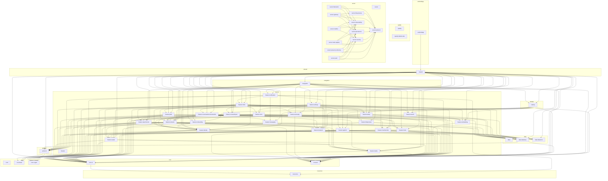

# Sparrow Architecture

Generated automatically by `./gradlew architectureReport`.

## Overview

| Metric | Count |
|---|---:|
| Modules | 52 |
| Module groups | 11 |
| Project dependencies | 230 |
| Kotlin files | 2041 |
| Test Kotlin files | 147 |
| Resource files | 57 |

## Module groups

### androidApp

- [**androidApp** (`:androidApp`)](modules/androidApp.md)

### core

- [**core** (`:core`)](modules/core.md)
- [**base** (`:core:base`)](modules/core-base.md)
- [**crypto** (`:core:crypto`)](modules/core-crypto.md)
- [**ui** (`:core:ui`)](modules/core-ui.md)
- [**util** (`:core:util`)](modules/core-util.md)

### data

- [**data** (`:data`)](modules/data.md)
- [**database** (`:data:database`)](modules/data-database.md)
- [**datastore** (`:data:datastore`)](modules/data-datastore.md)

### feature

- [**feature** (`:feature`)](modules/feature.md)
- [**applock** (`:feature:applock`)](modules/feature-applock.md)
- [**attachments** (`:feature:attachments`)](modules/feature-attachments.md)
- [**autoreply** (`:feature:autoreply`)](modules/feature-autoreply.md)
- [**avatar** (`:feature:avatar`)](modules/feature-avatar.md)
- [**chats** (`:feature:chats`)](modules/feature-chats.md)
- [**contactimport** (`:feature:contactimport`)](modules/feature-contactimport.md)
- [**contacts** (`:feature:contacts`)](modules/feature-contacts.md)
- [**conversationorchestration** (`:feature:conversationorchestration`)](modules/feature-conversationorchestration.md)
- [**embedding** (`:feature:embedding`)](modules/feature-embedding.md)
- [**identity** (`:feature:identity`)](modules/feature-identity.md)
- [**invite** (`:feature:invite`)](modules/feature-invite.md)
- [**linkpreview** (`:feature:linkpreview`)](modules/feature-linkpreview.md)
- [**media** (`:feature:media`)](modules/feature-media.md)
- [**membership** (`:feature:membership`)](modules/feature-membership.md)
- [**messaging** (`:feature:messaging`)](modules/feature-messaging.md)
- [**notification** (`:feature:notification`)](modules/feature-notification.md)
- [**onboarding** (`:feature:onboarding`)](modules/feature-onboarding.md)
- [**polls** (`:feature:polls`)](modules/feature-polls.md)
- [**safety** (`:feature:safety`)](modules/feature-safety.md)
- [**search** (`:feature:search`)](modules/feature-search.md)
- [**settings** (`:feature:settings`)](modules/feature-settings.md)
- [**transport** (`:feature:transport`)](modules/feature-transport.md)
- [**voice** (`:feature:voice`)](modules/feature-voice.md)

### navigation

- [**navigation** (`:navigation`)](modules/navigation.md)

### protocol

- [**protocol** (`:protocol`)](modules/protocol.md)

### quality

- [**quality** (`:quality`)](modules/quality.md)
- [**detekt-rules** (`:quality:detekt-rules`)](modules/quality-detekt-rules.md)

### resources

- [**resources** (`:resources`)](modules/resources.md)

### server

- [**server** (`:server`)](modules/server.md)
- [**federation** (`:server:federation`)](modules/server-federation.md)
- [**gateway** (`:server:gateway`)](modules/server-gateway.md)
- [**link-preview** (`:server:link-preview`)](modules/server-link-preview.md)
- [**mailbox** (`:server:mailbox`)](modules/server-mailbox.md)
- [**node-registry** (`:server:node-registry`)](modules/server-node-registry.md)
- [**observability** (`:server:observability`)](modules/server-observability.md)
- [**persistence** (`:server:persistence`)](modules/server-persistence.md)
- [**presence-directory** (`:server:presence-directory`)](modules/server-presence-directory.md)
- [**protocol** (`:server:protocol`)](modules/server-protocol.md)
- [**push** (`:server:push`)](modules/server-push.md)
- [**security** (`:server:security`)](modules/server-security.md)

### shared

- [**shared** (`:shared`)](modules/shared.md)

### startup

- [**startup** (`:startup`)](modules/startup.md)

## Module graph

```mermaid
graph TD

    subgraph group_androidApp["androidApp"]
        module_androidApp[":androidApp"]
    end

    subgraph group_core["core"]
        module_core[":core"]
        module_core_base[":core:base"]
        module_core_crypto[":core:crypto"]
        module_core_ui[":core:ui"]
        module_core_util[":core:util"]
    end

    subgraph group_data["data"]
        module_data[":data"]
        module_data_database[":data:database"]
        module_data_datastore[":data:datastore"]
    end

    subgraph group_feature["feature"]
        module_feature[":feature"]
        module_feature_applock[":feature:applock"]
        module_feature_attachments[":feature:attachments"]
        module_feature_autoreply[":feature:autoreply"]
        module_feature_avatar[":feature:avatar"]
        module_feature_chats[":feature:chats"]
        module_feature_contactimport[":feature:contactimport"]
        module_feature_contacts[":feature:contacts"]
        module_feature_conversationorchestration[":feature:conversationorchestration"]
        module_feature_embedding[":feature:embedding"]
        module_feature_identity[":feature:identity"]
        module_feature_invite[":feature:invite"]
        module_feature_linkpreview[":feature:linkpreview"]
        module_feature_media[":feature:media"]
        module_feature_membership[":feature:membership"]
        module_feature_messaging[":feature:messaging"]
        module_feature_notification[":feature:notification"]
        module_feature_onboarding[":feature:onboarding"]
        module_feature_polls[":feature:polls"]
        module_feature_safety[":feature:safety"]
        module_feature_search[":feature:search"]
        module_feature_settings[":feature:settings"]
        module_feature_transport[":feature:transport"]
        module_feature_voice[":feature:voice"]
    end

    subgraph group_navigation["navigation"]
        module_navigation[":navigation"]
    end

    subgraph group_protocol["protocol"]
        module_protocol[":protocol"]
    end

    subgraph group_quality["quality"]
        module_quality[":quality"]
        module_quality_detekt_rules[":quality:detekt-rules"]
    end

    subgraph group_resources["resources"]
        module_resources[":resources"]
    end

    subgraph group_server["server"]
        module_server[":server"]
        module_server_federation[":server:federation"]
        module_server_gateway[":server:gateway"]
        module_server_link_preview[":server:link-preview"]
        module_server_mailbox[":server:mailbox"]
        module_server_node_registry[":server:node-registry"]
        module_server_observability[":server:observability"]
        module_server_persistence[":server:persistence"]
        module_server_presence_directory[":server:presence-directory"]
        module_server_protocol[":server:protocol"]
        module_server_push[":server:push"]
        module_server_security[":server:security"]
    end

    subgraph group_shared["shared"]
        module_shared[":shared"]
    end

    subgraph group_startup["startup"]
        module_startup[":startup"]
    end

    module_androidApp --> module_shared
    module_core_ui --> module_resources
    module_data_database --> module_core_util
    module_data_database --> module_protocol
    module_feature_applock --> module_core_ui
    module_feature_applock --> module_core_util
    module_feature_applock --> module_data_datastore
    module_feature_attachments --> module_core_base
    module_feature_attachments --> module_core_crypto
    module_feature_attachments --> module_core_ui
    module_feature_attachments --> module_core_util
    module_feature_attachments --> module_data_database
    module_feature_attachments --> module_feature_media
    module_feature_attachments --> module_feature_transport
    module_feature_attachments --> module_protocol
    module_feature_autoreply --> module_core_ui
    module_feature_autoreply --> module_core_util
    module_feature_autoreply --> module_data_database
    module_feature_avatar --> module_core_ui
    module_feature_avatar --> module_core_util
    module_feature_avatar --> module_feature_media
    module_feature_avatar --> module_protocol
    module_feature_chats --> module_core_base
    module_feature_chats --> module_core_crypto
    module_feature_chats --> module_core_ui
    module_feature_chats --> module_core_util
    module_feature_chats --> module_data_database
    module_feature_chats --> module_data_datastore
    module_feature_chats --> module_feature_attachments
    module_feature_chats --> module_feature_autoreply
    module_feature_chats --> module_feature_avatar
    module_feature_chats --> module_feature_contactimport
    module_feature_chats --> module_feature_contacts
    module_feature_chats --> module_feature_conversationorchestration
    module_feature_chats --> module_feature_identity
    module_feature_chats --> module_feature_linkpreview
    module_feature_chats --> module_feature_media
    module_feature_chats --> module_feature_membership
    module_feature_chats --> module_feature_polls
    module_feature_chats --> module_feature_safety
    module_feature_chats --> module_feature_transport
    module_feature_chats --> module_feature_voice
    module_feature_chats --> module_protocol
    module_feature_contactimport --> module_core_ui
    module_feature_contactimport --> module_core_util
    module_feature_contactimport --> module_feature_contacts
    module_feature_contactimport --> module_feature_identity
    module_feature_contactimport --> module_feature_invite
    module_feature_contacts --> module_core_crypto
    module_feature_contacts --> module_core_ui
    module_feature_contacts --> module_core_util
    module_feature_contacts --> module_data_database
    module_feature_contacts --> module_feature_avatar
    module_feature_contacts --> module_feature_identity
    module_feature_contacts --> module_feature_transport
    module_feature_contacts --> module_protocol
    module_feature_conversationorchestration --> module_core_crypto
    module_feature_conversationorchestration --> module_core_util
    module_feature_conversationorchestration --> module_feature_contacts
    module_feature_conversationorchestration --> module_feature_identity
    module_feature_conversationorchestration --> module_feature_invite
    module_feature_conversationorchestration --> module_feature_membership
    module_feature_conversationorchestration --> module_feature_messaging
    module_feature_conversationorchestration --> module_feature_transport
    module_feature_conversationorchestration --> module_protocol
    module_feature_embedding --> module_core_util
    module_feature_embedding --> module_data_datastore
    module_feature_identity --> module_core_crypto
    module_feature_identity --> module_core_ui
    module_feature_identity --> module_core_util
    module_feature_identity --> module_data_database
    module_feature_identity --> module_data_datastore
    module_feature_identity --> module_feature_avatar
    module_feature_identity --> module_protocol
    module_feature_invite --> module_core_ui
    module_feature_invite --> module_core_util
    module_feature_invite --> module_data_database
    module_feature_invite --> module_feature_avatar
    module_feature_linkpreview --> module_core_ui
    module_feature_linkpreview --> module_core_util
    module_feature_linkpreview --> module_data_database
    module_feature_linkpreview --> module_feature_transport
    module_feature_media --> module_core_ui
    module_feature_media --> module_core_util
    module_feature_membership --> module_core_crypto
    module_feature_membership --> module_core_util
    module_feature_membership --> module_data_database
    module_feature_membership --> module_data_datastore
    module_feature_membership --> module_protocol
    module_feature_messaging --> module_core_util
    module_feature_messaging --> module_protocol
    module_feature_notification --> module_core_crypto
    module_feature_notification --> module_core_util
    module_feature_notification --> module_feature_chats
    module_feature_notification --> module_feature_messaging
    module_feature_notification --> module_feature_transport
    module_feature_notification --> module_protocol
    module_feature_notification --> module_resources
    module_feature_onboarding --> module_core_ui
    module_feature_onboarding --> module_feature_identity
    module_feature_onboarding --> module_feature_media
    module_feature_polls --> module_core_ui
    module_feature_polls --> module_core_util
    module_feature_polls --> module_feature_attachments
    module_feature_polls --> module_feature_avatar
    module_feature_polls --> module_feature_media
    module_feature_polls --> module_protocol
    module_feature_safety --> module_core_ui
    module_feature_safety --> module_core_util
    module_feature_safety --> module_data_database
    module_feature_safety --> module_feature_contacts
    module_feature_safety --> module_feature_embedding
    module_feature_search --> module_core_ui
    module_feature_search --> module_core_util
    module_feature_search --> module_data_database
    module_feature_search --> module_feature_embedding
    module_feature_settings --> module_core_ui
    module_feature_settings --> module_core_util
    module_feature_settings --> module_data_datastore
    module_feature_settings --> module_feature_applock
    module_feature_settings --> module_feature_autoreply
    module_feature_settings --> module_feature_avatar
    module_feature_settings --> module_feature_contacts
    module_feature_settings --> module_feature_embedding
    module_feature_settings --> module_feature_identity
    module_feature_settings --> module_feature_safety
    module_feature_settings --> module_feature_search
    module_feature_settings --> module_feature_transport
    module_feature_settings --> module_feature_voice
    module_feature_transport --> module_core_crypto
    module_feature_transport --> module_core_util
    module_feature_transport --> module_data_datastore
    module_feature_transport --> module_protocol
    module_feature_voice --> module_core_base
    module_feature_voice --> module_core_ui
    module_feature_voice --> module_core_util
    module_feature_voice --> module_data_datastore
    module_feature_voice --> module_feature_attachments
    module_feature_voice --> module_feature_media
    module_feature_voice --> module_protocol
    module_navigation --> module_core_ui
    module_navigation --> module_core_util
    module_navigation --> module_feature_attachments
    module_navigation --> module_feature_autoreply
    module_navigation --> module_feature_chats
    module_navigation --> module_feature_contactimport
    module_navigation --> module_feature_contacts
    module_navigation --> module_feature_conversationorchestration
    module_navigation --> module_feature_identity
    module_navigation --> module_feature_invite
    module_navigation --> module_feature_media
    module_navigation --> module_feature_membership
    module_navigation --> module_feature_notification
    module_navigation --> module_feature_onboarding
    module_navigation --> module_feature_polls
    module_navigation --> module_feature_safety
    module_navigation --> module_feature_search
    module_navigation --> module_feature_settings
    module_navigation --> module_startup
    module_protocol --> module_core_base
    module_protocol --> module_core_crypto
    module_protocol --> module_core_util
    module_server_federation --> module_server_observability
    module_server_federation --> module_server_persistence
    module_server_federation --> module_server_protocol
    module_server_federation --> module_server_security
    module_server_gateway --> module_server_link_preview
    module_server_gateway --> module_server_observability
    module_server_gateway --> module_server_persistence
    module_server_gateway --> module_server_protocol
    module_server_gateway --> module_server_security
    module_server_link_preview --> module_server_protocol
    module_server_mailbox --> module_server_observability
    module_server_mailbox --> module_server_persistence
    module_server_mailbox --> module_server_protocol
    module_server_mailbox --> module_server_security
    module_server_node_registry --> module_server_observability
    module_server_node_registry --> module_server_persistence
    module_server_node_registry --> module_server_protocol
    module_server_node_registry --> module_server_security
    module_server_persistence --> module_server_protocol
    module_server_presence_directory --> module_server_observability
    module_server_presence_directory --> module_server_persistence
    module_server_presence_directory --> module_server_protocol
    module_server_presence_directory --> module_server_security
    module_server_push --> module_server_observability
    module_server_push --> module_server_persistence
    module_server_push --> module_server_protocol
    module_server_push --> module_server_security
    module_server_security --> module_server_protocol
    module_shared --> module_core_crypto
    module_shared --> module_core_ui
    module_shared --> module_core_util
    module_shared --> module_data_database
    module_shared --> module_data_datastore
    module_shared --> module_feature_applock
    module_shared --> module_feature_attachments
    module_shared --> module_feature_autoreply
    module_shared --> module_feature_avatar
    module_shared --> module_feature_chats
    module_shared --> module_feature_contactimport
    module_shared --> module_feature_contacts
    module_shared --> module_feature_conversationorchestration
    module_shared --> module_feature_embedding
    module_shared --> module_feature_identity
    module_shared --> module_feature_invite
    module_shared --> module_feature_linkpreview
    module_shared --> module_feature_media
    module_shared --> module_feature_membership
    module_shared --> module_feature_messaging
    module_shared --> module_feature_notification
    module_shared --> module_feature_onboarding
    module_shared --> module_feature_polls
    module_shared --> module_feature_safety
    module_shared --> module_feature_search
    module_shared --> module_feature_settings
    module_shared --> module_feature_transport
    module_shared --> module_feature_voice
    module_shared --> module_navigation
    module_shared --> module_protocol
    module_shared --> module_startup
    module_startup --> module_core_ui
    module_startup --> module_core_util
    module_startup --> module_feature_applock
    module_startup --> module_feature_embedding
    module_startup --> module_feature_identity
    module_startup --> module_feature_onboarding
    module_startup --> module_feature_safety
    module_startup --> module_feature_search
    module_startup --> module_feature_transport
```
