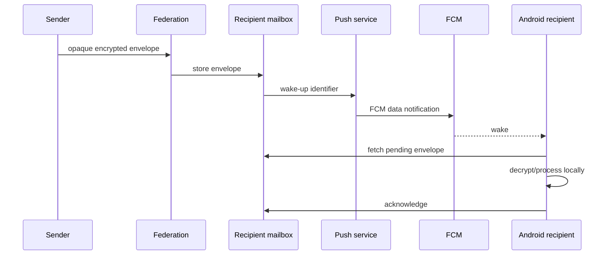

# Push notifications and offline delivery

Push is used as a **wake-up mechanism**, not as the canonical plaintext message transport.

## Components

Client/common notification orchestration:

- `RegisterPushTokenUseCase`
- `SynchronizePendingMessagesUseCase`
- `ConversationNotificationCoordinator`
- `AppVisibilityState`

Android implementation:

- `SparrowFirebaseMessagingService`
- `PushTokenRegistrationWorker`
- `PendingMessageSyncWorker`
- `AndroidNotificationRuntime`
- `SparrowNotificationManager`

Transport gateways:

- `HttpPushTokenRegistrationGateway`
- `HttpPendingEnvelopeGateway`
- mailbox gateway in `:feature:transport`

Server:

- `PushCoordinator`
- `FirebasePushSender`
- `PostgresPushDeviceStore`
- `PostgresPendingEnvelopeStore`
- `PostgresWakeUpStore`
- `MailboxPushNotifier`

## Normal offline flow

Legacy/compatibility pending-envelope behavior can exist for clients that do not yet have a usable mailbox route, but the preferred model is recipient-selected mailbox delivery.

## Firebase credentials

The Control Plane push service needs Firebase Admin credentials for real FCM delivery. Without them, local server health may still run depending on configuration, but real Android background wake-ups will not work.

Do not commit `firebase-admin.json` or other production credentials.

### Android Firebase app after the Sparrow rebrand

The Android application ID is now `com.cbgm.sparrow`. Register that Android app in the existing Firebase project and replace `androidApp/google-services.json` with the configuration downloaded for **that exact package name** before validating real FCM delivery. The server-side Firebase Admin service account can stay in the same Firebase project.

## Force stop caveat

Android's explicit **Force stop** prevents normal background scheduling/FCM behavior until the user launches the app again. Test “background delivery” by leaving the app/background process normally, not by relying on Force stop as a supported delivery state.
