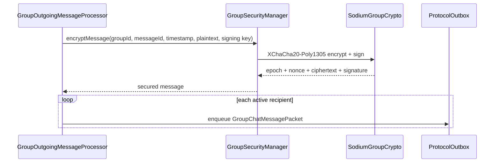

# Encryption

## Direct transport payloads

`SodiumTransportMessageCipher` implements `TransportMessageCipher`.

Current encrypted mode:

```text
TransportEncryptionMode.SEALED_BOX
version = 1
```

Encryption uses libsodium `Box.seal`; decryption uses `Box.sealOpen`. The recipient's encryption public key protects the payload without requiring the server to know a symmetric session secret.

## Packet policy

Not every protocol packet can use the exact same transport protection at every point in a relationship. `OutgoingPacketTransportPolicy`/its default implementation decides whether a packet:

- must use an encrypted mutual-identity path;
- is a bootstrap/invitation packet that must be deliverable before the normal identity relationship exists;
- is Group traffic whose own group security context applies.

Do not move this decision into the WebSocket layer. The WebSocket layer should receive an already prepared opaque transport payload.

## Group encryption

`SodiumGroupCrypto` uses:

- 32-byte group keys;
- XChaCha20-Poly1305-IETF for authenticated encryption;
- 24-byte nonces;
- associated data;
- sealed boxes to wrap group keys to members;
- detached signatures to authenticate signed group payloads.

`GroupSecurityManager` and the epoch/key persistence code decide which group key/epoch applies to a message.


