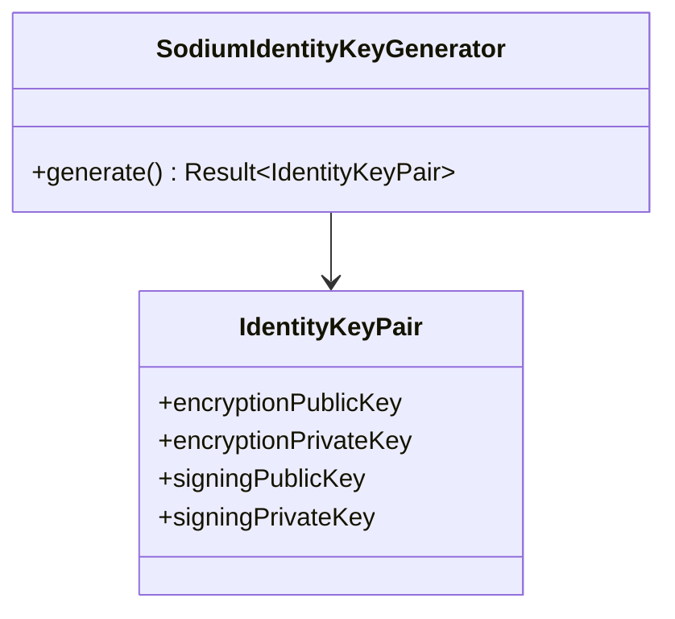
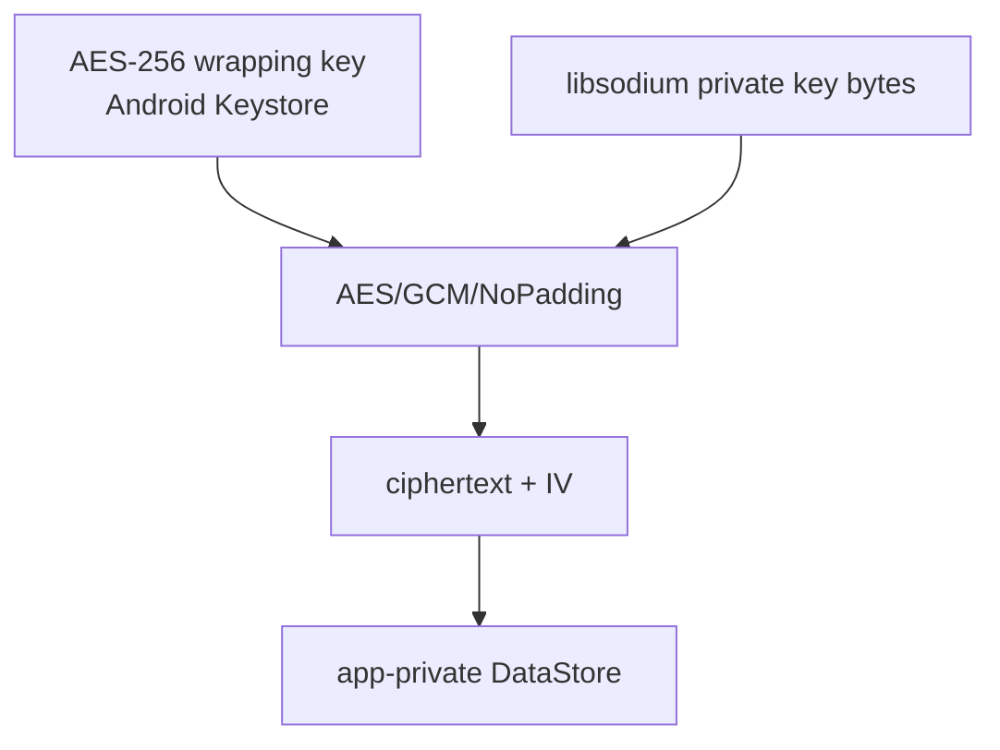

# Identity and key storage

## Key generation

`SodiumIdentityKeyGenerator` creates two separate key pairs:

- encryption pair: libsodium `Box.keypair()`;
- signing pair: libsodium `Signature.keypair()`.

The public keys form the public identity used for encryption/verification. Private keys stay on the device.

## Android private-key storage

`AndroidPrivateKeyStorage` does not store the X25519/box and signing private-key bytes directly as plaintext preferences.

A separate AES-GCM operation/IV is used for encryption and signing private-key values. The Android Keystore holds the wrapping key.

## Identity changes

Identity replacement is security-sensitive. Contact/group flows pin/compare identity material and surface verification/security state instead of silently treating a new identity as the old one. Mailbox capabilities and authorization state can be revoked/re-established when identity relationships change.
