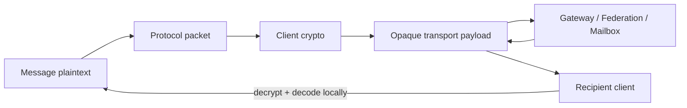

# Security overview

SecureChat separates client cryptography, identity verification and server infrastructure authentication. This page describes the current implementation; it is not a formal security proof or external audit.

## Client cryptographic building blocks

| Purpose | Implementation |
|---|---|
| Identity encryption key pair | `SodiumIdentityKeyGenerator` using libsodium `Box.keypair()` |
| Identity signing key pair | `SodiumIdentityKeyGenerator` using libsodium `Signature.keypair()` |
| Direct transport payload encryption | `SodiumTransportMessageCipher` using libsodium sealed boxes |
| Detached signatures | `SodiumDetachedSignatureCrypto` |
| Group symmetric encryption | `SodiumGroupCrypto` using XChaCha20-Poly1305-IETF |
| Group-key wrapping | `SodiumGroupCrypto` using sealed boxes |
| Safety number | `SafetyNumberGenerator` using SHA-256 |
| Android private-key at-rest protection | `AndroidPrivateKeyStorage` using Android Keystore AES-256 + AES-GCM |

## Security boundary

For encrypted message paths, server components route/store opaque payloads and do not need the chat plaintext.

## Identity

Each client identity has separate encryption and signing key material. The public identity is shareable; the private material is kept local. Android wraps the libsodium private-key bytes with an AES key stored in Android Keystore before storing ciphertext/IV metadata in app-private preferences.

## Direct transport protection

`SodiumTransportMessageCipher` uses libsodium sealed boxes (`Box.seal` / `Box.sealOpen`) with 32-byte box public/private keys. The transport format carries an explicit mode/version so decoding can reject unsupported formats.

## Groups

`SodiumGroupCrypto` generates a 32-byte group key and encrypts group message content with XChaCha20-Poly1305-IETF and a 24-byte nonce. Associated data binds protocol context. Group keys are wrapped to members with sealed boxes, and signed group payloads use detached signatures.

Membership/security epochs are managed client-side by the Group security/membership components; server routing is not a source of group membership authority.

## Safety numbers

`SafetyNumberGenerator` deterministically orders the two parties' public identity key sets, prefixes lengths, includes the domain separator `SecureChat Safety Number v1`, hashes with SHA-256, and renders five-digit groups. Both peers should derive the same number for the same current identities.

## Server authentication

Server nodes use their own long-lived node identity and signed requests. `server:security` contains:

- `NodeIdentity` / `NodeIdentityStore`;
- `NodeRequestAuthentication` / `NodeRequestAuthorizer`;
- `ProtocolSignatures`;
- `ReplayProtection`;
- `BoundedRateLimiter` and the `enforceRateLimit()` helper;
- registry certificate/signature helpers.

Signed node descriptors let clients verify that a discovered Community Node is authorized by the Control Plane trust material rather than trusting an arbitrary URL returned by an unverified source.

## What this does not claim

- No claim of a completed independent cryptographic audit.
- No claim that metadata (timing, IP connection, routing activity, node load) is hidden from all infrastructure.
- No claim of iOS parity; the iOS runtime is not usable yet.
- Security depends on correct key verification, endpoint trust, OS integrity and release/build key handling.
