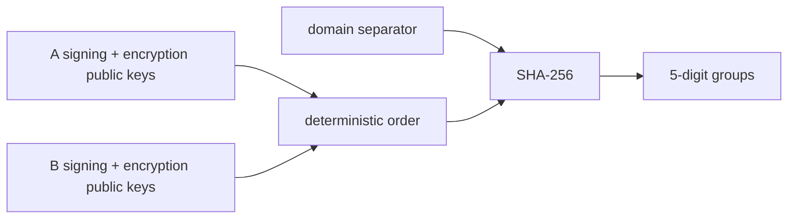

# Safety numbers

Safety numbers let two users compare the cryptographic public identities they currently see.

`SafetyNumberGenerator`:

1. encodes each party's signing and encryption public keys with length prefixes;
2. lexicographically orders the two encoded identities so A/B and B/A produce the same input;
3. prefixes `Sparrow Safety Number v1`;
4. computes SHA-256;
5. converts each two digest bytes into a zero-padded five-digit group.

If a contact's identity changes, the old comparison no longer represents the current identity and verification must be reconsidered.
