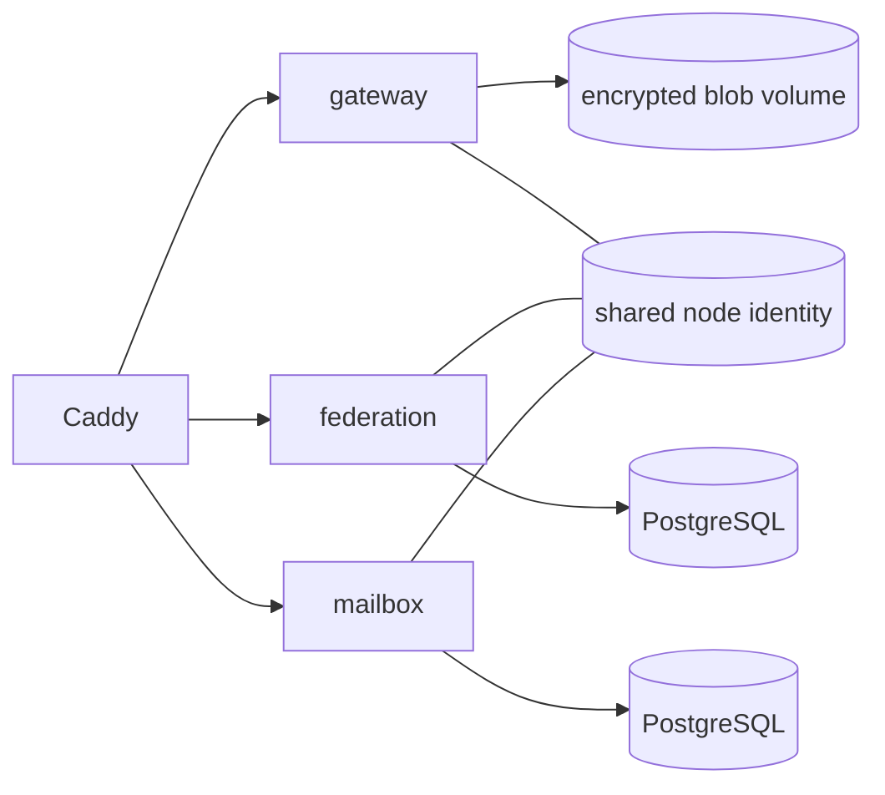

# Community Node

A Community Node is Sparrow's message-transport edge. It accepts client WebSocket sessions, routes/federates encrypted envelopes, stores recipient-selected offline mailbox data, and stores opaque encrypted attachment blobs.

## Runtime topology

`server/community-node/docker-compose.yml` defines:



Compose services are `caddy`, `mailbox-database`, `mailbox`, `federation-database`, `federation`, `blob-storage-init`, and `gateway`.

## Gateway

`:server:gateway` terminates the Sparrow client WebSocket protocol and the node-facing blob HTTP API. Important classes include:

- `GatewayWebSocketHandler`
- `GatewaySessionHandler`
- `ConnectionRegistry`
- `BlobStore`
- `BlobCleanupAgent`
- `BlobUploadPermitStore`
- `GatewayBlobUploadTicketIssuer`
- `HttpFederationClient`
- `HttpPresenceClient`
- `HttpNodePushClient`

The gateway sees routing metadata/envelopes but application payloads remain end-to-end encrypted by the client protocol. Attachment storage contains encrypted blob bytes rather than decoded media.

## Federation

`:server:federation` handles routing between Community Nodes. Important classes include `FederationRouter`, `FederationPeerRouter`, `OutboundEnvelopeQueue`, `OutboundEnvelopeRetryAgent`, `NodeRegistrationAgent`, `CachingNodeRegistryClient`, `HttpPresenceDirectoryClient`, `HttpLocalGatewayClient`, `HttpRemoteFederationClient`, and `HttpMailboxClient`.

A node registers/publishes itself through selected Control Plane infrastructure, learns other signed node descriptors, and can route an envelope to a peer node without either server needing the plaintext conversation content.

## Offline mailbox

`:server:mailbox` provides durable recipient-selected offline delivery. `MailboxStore` / `PostgresMailboxStore` own mailbox persistence and `MailboxPushNotifier` coordinates wake-ups after mailbox insertion. Mailbox capability/create/revoke/fetch routes are defined by the mailbox HTTP routing layer.

At the client, mailbox fetch ultimately enters the same incoming-envelope processing pipeline as live WebSocket delivery; the message is not treated as a different plaintext protocol.

## Attachment blobs

Caddy routes `/v1/blobs/*` to the gateway. Uploads require short-lived upload authorization/tickets; downloads and deletion are capability-based. The persistent gateway blob volume stores encrypted bytes plus server-side metadata required for size, expiration and capability enforcement. `BlobCleanupAgent` removes expired data.

## Unified multi-node management

The current public operator bundle is `dist/sparrow-server.zip`, generated from `server/unified`. On Windows `Start-SparrowServer.cmd` can open **Community Node only — manage instances**. Each node instance receives a distinct Compose project, node signing identity, secrets/cache and named volumes; multiple nodes are not simulated as unrelated identities inside one container.

Node-only installs use an existing Control Plane directly or, in the advanced flow, a signed independent Control Plane Directory with a separately trusted/pinned key. They do not install a hidden Control Plane.

Linux/macOS have equivalent commands through `Start-SparrowServer.sh` (`nodes --help` for node-instance management).

## LAN/public endpoints

A default LAN deployment exposes the node Caddy edge on port `8490`; the client gateway is normally advertised as `ws://<host>:8490/v1/gateway`. Public mode advertises HTTPS/WSS through the configured public hostname.

`/index` provides links for gateway health/info, advertised Control Planes, federation capabilities/health and mailbox health.

## Failure/retry behavior

`NodeRegistrationAgent` and the cached registry/directory state allow a configured node to tolerate temporary Control Plane outages. Federation maintains a persistent outbound queue and retry agent for cross-node delivery. This is separate from the **client** durable outbox: both layers can retry their own responsibility without servers learning application plaintext.

## Running directly from source

For development, supply reachable endpoints and run:

```bash
docker compose -f server/community-node/docker-compose.yml up -d --build
```

For multiple local nodes use separate Compose project names/ports/volumes or the repository's multi-node/smoke tooling; do not start two identical projects that share identities and ports.
