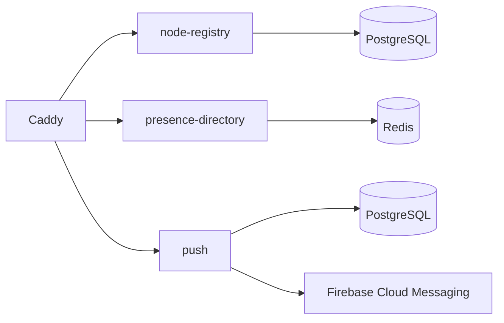

# Control Plane

A Sparrow Control Plane is the discovery, presence and push side of the network. It does **not** carry normal client WebSocket message traffic and it does not decrypt application messages.

## Runtime topology

`server/control-plane/docker-compose.yml` defines the production-shaped stack:



Compose services are `caddy`, `node-registry-database`, `node-registry`, `presence-redis`, `presence-directory`, `push-database`, and `push`.

## Kotlin server modules and important classes

### `:server:node-registry`

The registry accepts authorized node registration/heartbeats and publishes node descriptors used by clients and other nodes. Important implementation types include `NodeRegistryStore`, `RegistryDirectorySigner`, `DirectRegistryDirectorySigner`, `RotatingRegistryDirectorySigner` and `RegistryAuthorityCertificateStore`.

The registry signing path matters because Sparrow does not treat an arbitrary list of node URLs as trusted routing data. Directory/registry responses are signed and verified by clients before node selection.

### `:server:presence-directory`

Presence is intentionally short-lived routing state. Redis is used for state that can be reconstructed as nodes/clients reconnect; it is not the authoritative store for conversations or messages.

### `:server:push`

The push service stores the registration state required for wake-ups and coordinates Android FCM notification delivery. Important types include `PushCoordinator` and `FirebasePushSender`. Push wakes a client so it can fetch encrypted mailbox traffic; it is not a plaintext message-delivery channel.

## Control Plane vs. independent directory

Do not confuse a Control Plane with `server/control-plane-directory`.

- A **Control Plane** publishes/serves node registry, presence and push services.
- The **Independent Control Plane Directory** publishes a signed list of Control Plane origins and verifies ownership during Control Plane registration.
- The independent directory is operator infrastructure and is deliberately excluded from the public Sparrow server bundle.

See [Server runtime, build and deployment](runtime-build-deployment.md#independent-control-plane-directory-operator-only).

## Unified server manager

The current operator entry point is the unified tooling under `server/unified`, not the older separate Control-Plane launcher flow.

Windows source checkout:

```text
server\unified\Build-SparrowServer.cmd
```

builds `dist/sparrow-server.zip`. Inside the unified runtime, `Start-SparrowServer.cmd` opens the Windows manager. Choose **Control Plane** or **Combined**, then use **Install / Start**.

Linux/macOS use the corresponding `Start-SparrowServer.sh` / `Start-SparrowServer.command` CLI flow. A developer can also run the Compose file directly from source.

## LAN and public deployment

In LAN mode the Control Plane Caddy edge is normally exposed on port `8390`. `/index` is the operator-friendly entry page and links to registry/presence/push health and node information.

Public mode uses Caddy/TLS and a public hostname. In a unified Combined installation, Control Plane and Community Node remain separate Compose projects; an optional shared public-edge Caddy routes their distinct hostnames.

## State that must survive upgrades

A valuable deployment must preserve at least:

- registry signing/authority material;
- PostgreSQL registry and push state;
- Redis configuration/state as appropriate for the deployment;
- generated runtime secrets;
- Caddy/TLS state when used;
- `.env.runtime` and the runtime ownership information used by the unified manager.

`Install / Start` on an intact existing unified runtime updates selected Sparrow backend images in place and is deliberately designed not to recreate stateful stores or identities as a normal update mechanism. Backups are still required before meaningful upgrades because database migrations can be incompatible.

## Running directly from source

For development:

```bash
docker compose -f server/control-plane/docker-compose.yml up -d --build
```

Use `docker compose ... ps` and `logs` to inspect startup. Real Firebase push delivery additionally requires correctly authorized service-account credentials; without them the rest of the stack can still be developed/tested but real FCM delivery is unavailable.
