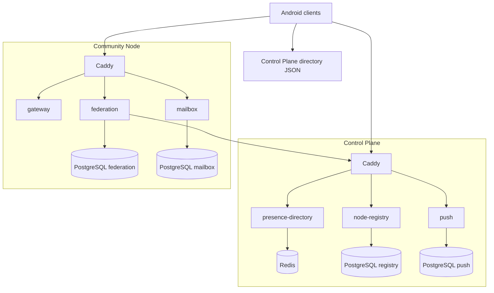
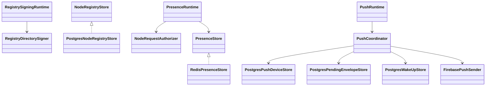
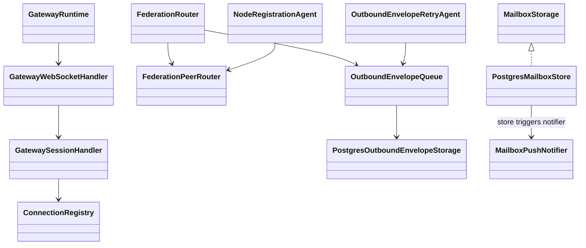

# Server overview

Sparrow's production-shaped server is split into two independently deployable packages.

## Control Plane services

### `node-registry`

Stores signed Community Node descriptors and heartbeats. Public `/v1/nodes` returns currently healthy compatible
nodes. The registry uses PostgreSQL and signing authority material.

Key classes:

- `com.cbgm.sparrow.server.registry.ApplicationKt`
- `NodeRegistryStore`
- `PostgresNodeRegistryStore`
- `RegistrySigningRuntime`
- `RegistryDirectorySigner`

### `presence-directory`

Stores short-lived routing information mapping a client routing ID to its current node/connection. Redis is used
because presence is ephemeral and should be rebuilt by reconnecting clients.

Key classes:

- `PresenceRuntime`
- `installPresenceRoutes()`
- `RedisPresenceStore`
- `NodeRequestAuthorizer`

### `push`

Stores Android device registrations and wake-up/pending fallback information. It integrates with Firebase Admin
when credentials are configured.

Key classes:

- `PushRuntime`
- `PushCoordinator`
- `PostgresPushDeviceStore`
- `PostgresPendingEnvelopeStore`
- `PostgresWakeUpStore`
- `FirebasePushSender`

## Community Node services

### `gateway`

Owns client WebSockets, connection registry, route refresh handling, typing and envelope ingress/egress.

Key classes:

- `GatewayRuntime`
- `installGatewayRoutes()`
- `GatewayWebSocketHandler`
- `GatewaySessionHandler`
- `ConnectionRegistry`

### `federation`

Routes envelopes locally or to another node, resolves recipient presence, queues failed routes durably and retries.
It also registers/heartbeats the node against configured Control Planes.

Key classes:

- `FederationRouter`
- `FederationPeerRouter`
- `OutboundEnvelopeQueue`
- `PostgresOutboundEnvelopeStorage`
- `OutboundEnvelopeRetryAgent`
- `NodeRegistrationAgent`
- `CachingNodeRegistryClient`

### `mailbox`

Provides recipient-selected offline stores. Mailboxes are capability protected; encrypted envelopes can be stored,
retrieved, acknowledged and the entire mailbox can be revoked.

Key classes:

- `configureMailboxRoutes()`
- `MailboxStorage`
- `PostgresMailboxStore`
- `MailboxPushNotifier`

## Shared server modules

- `server:protocol` — HTTP/federation wire models.
- `server:security` — Ed25519 node identity/signatures, replay protection, rate limits, routing IDs.
- `server:persistence` — shared environment/idempotency helpers.
- `server:observability` — health/readiness, metrics, request IDs.

## Operator pages

Every launcher deployment exposes a `/index` page:

- Control Plane `/index`: registry, presence, push, connected nodes.
- Community Node `/index`: gateway health/info/connections, advertised planes, federation, mailbox.

See [Control Plane](control-plane.md) and [Community Node](community-node.md).

## Runtime class relationships

### Control Plane

### Community Node

The diagrams show responsibility/usage relationships, not every constructor parameter.
