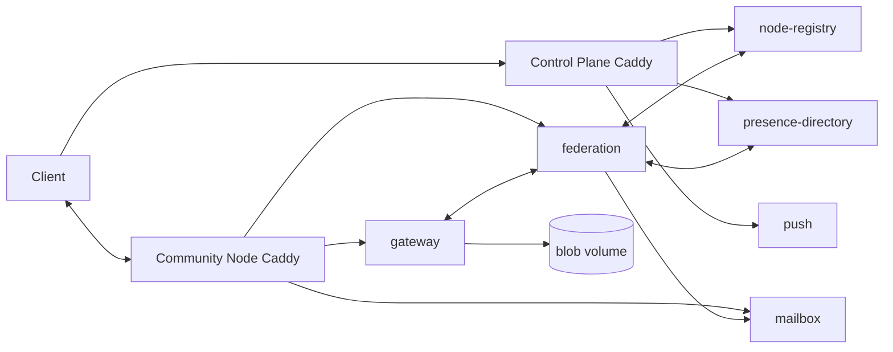
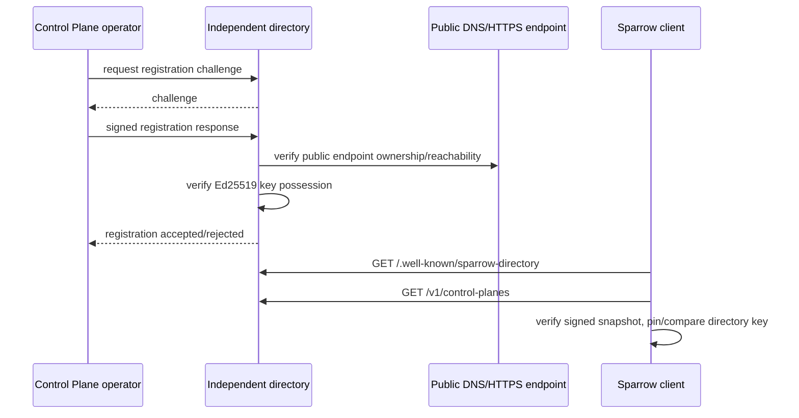

# Server runtime, build and deployment

This page describes the current server tree and the unified installer/runtime tooling.

## Deployable topology

### Control Plane

`server/control-plane/docker-compose.yml` runs:

- `caddy`
- `node-registry-database` (PostgreSQL)
- `node-registry` (`:server:node-registry`)
- `presence-redis`
- `presence-directory` (`:server:presence-directory`)
- `push-database` (PostgreSQL)
- `push` (`:server:push`)

### Community Node

`server/community-node/docker-compose.yml` runs:

- `caddy`
- `mailbox-database` + `mailbox` (`:server:mailbox`)
- `federation-database` + `federation` (`:server:federation`)
- `blob-storage-init`
- `gateway` (`:server:gateway`)

The Community Node shares a persistent `node-identity` volume between mailbox/federation/gateway and a persistent gateway blob volume for encrypted attachment blobs.

### Optional public shared proxy

`server/unified/public-proxy/docker-compose.yml` runs shared public-edge Caddy plus directory registration/synchronization helpers. Public Control Plane and Community Node hostnames can therefore share one public host while remaining independent Compose projects.

## Server request flow



## Important server classes

Gateway:

- `GatewayWebSocketHandler`
- `GatewaySessionHandler`
- `ConnectionRegistry`
- `BlobStore`
- `BlobCleanupAgent`
- `BlobUploadPermitStore`, `GatewayBlobUploadTicketIssuer`
- `HttpFederationClient`, `HttpPresenceClient`, `HttpNodePushClient`

Federation:

- `FederationRouter`
- `FederationPeerRouter`
- `OutboundEnvelopeQueue`
- `OutboundEnvelopeRetryAgent`
- `NodeRegistrationAgent`
- `CachingNodeRegistryClient`
- `HttpPresenceDirectoryClient`, `HttpLocalGatewayClient`, `HttpRemoteFederationClient`, `HttpMailboxClient`

Mailbox:

- `MailboxStore`
- `PostgresMailboxStore`
- `MailboxPushNotifier`
- mailbox capability/create/revoke/fetch HTTP routes in `MailboxRoutes`

Registry/presence/push:

- `NodeRegistryStore`
- `RegistryDirectorySigner`, `DirectRegistryDirectorySigner`, `RotatingRegistryDirectorySigner`
- `RegistryAuthorityCertificateStore`
- `PushCoordinator`
- `FirebasePushSender`
- PostgreSQL push stores

Link preview:

- `LinkPreviewService`
- `LinkPreviewFetcher`
- `LinkPreviewHtmlParser`
- `LinkPreviewUrlValidator`

## Unified installer/runtime

The active unified bundle lives in `server/unified`.

Key entry points:

- `Build-SparrowServer.cmd` — build a fresh distributable from the repository root on Windows.
- `New-SparrowServerBundle.ps1` — constructs the bundle.
- `Start-SparrowServer.ps1`, `Start-SparrowServer.sh`, `Start-SparrowServer.command` — platform launchers.
- `Invoke-SparrowServer.ps1` / `.py` — runtime lifecycle operations.
- `Manage-SparrowNodes.ps1` / `.py` — node-only multi-instance management.
- `Update-SparrowFromGitHub.ps1` — guarded source/runtime tooling update path.
- `Backup-SparrowDeployment.ps1` — deployment backup support.
- `Invoke-SparrowPublicCutover.ps1`, `Stage-SparrowPublicTls.ps1`, `Attached-SparrowDeployment.ps1` — advanced migration/public-edge tooling.
- `Get-SparrowVerifiedDirectory.ps1` plus `control_plane_directory_*.py` — signed directory consumption/registration/synchronization.

## Install / Start semantics

The unified manager treats Control Plane and Community Node as independent Compose projects. In Combined mode both are managed from one runtime directory; node-only mode can manage multiple Community Node instances against an existing Control Plane.

On an existing installation with `.env.runtime`, **Install / Start** validates ownership, pulls only the selected Sparrow backend images and applies changed backend services without intentionally recreating PostgreSQL/Redis/Caddy volumes or identities.

A fresh test runtime with missing `.env.runtime` can discard abandoned test containers/volumes when ownership is unambiguous. Intact or ambiguous existing deployments are deliberately refused rather than silently taken over.

## Building the unified bundle

From repository root on Windows:

```cmd
server\unified\Build-SparrowServer.cmd
```

The wrapper invokes `New-SparrowServerBundle.ps1` with process-local PowerShell execution-policy bypass. The expected development artifact is `dist/sparrow-server.zip`.

## Service image build

Each executable Ktor service has an `application` main class and is built through the common `server/Dockerfile` using a `SERVICE` build argument. Compose files select service names such as `gateway`, `federation`, `mailbox`, `node-registry`, `presence-directory` and `push`.

## Backups and upgrades

Normal updates are not a substitute for backups. Backend image updates may include incompatible database migrations. Persistent server identities, PostgreSQL/Redis state, queues, mailbox state and TLS data should be treated as deployment state, not as files that can be regenerated safely for a valuable installation.

Use the unified runtime README files (`server/unified/README.md`, `README_RUNTIME.md`) as the operational source of truth for exact manager commands and safety guards.


## Independent Control Plane Directory (operator-only)

`server/control-plane-directory` is intentionally **not** part of the public unified Sparrow server ZIP. It is separate operator infrastructure whose job is to publish and authenticate the set of Control Planes.

Its implementation is Python rather than a Gradle server module. Important source files are:

- `directory_service.py` — HTTP service and signed directory implementation;
- `directory_admin_cli.py` — private administrator operations;
- `Start-SparrowDirectory.cmd`, `.ps1`, `.sh` — private deployment entry points;
- `Build-SparrowDirectoryInstaller.py` — private installer builder;
- `docker-compose.yml` and `Dockerfile` — standalone deployment.

Public routes are:

```text
GET  /health
GET  /.well-known/sparrow-directory
GET  /v1/control-planes
POST /v1/registrations/challenge
POST /v1/registrations
```

A new Control Plane registration must demonstrate both reachable DNS/public HTTPS endpoint possession and possession of its Ed25519 signing key. Revoked identities are not automatically restored, and endpoint/key changes require a separate authenticated process.



The directory signing key and SQLite state live in the persistent `sparrow-central-directory-state` Docker volume and must not be regenerated on an ordinary restart/update. Clients preserve previously verified candidates during an outage. A compromised directory signing key requires a dedicated secure recovery procedure; merely editing the URL is not a safe recovery mechanism and such key-recovery automation is not currently implemented.

`New-SparrowServerBundle.ps1` deliberately excludes this directory service from `dist/sparrow-server.zip`. Never publish its private admin token, persistent state, installer, or operator credentials as public release assets.
