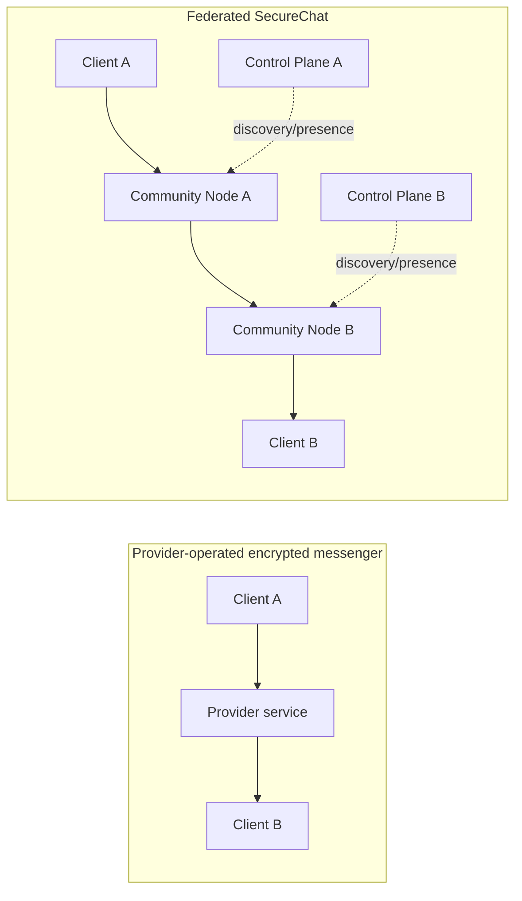
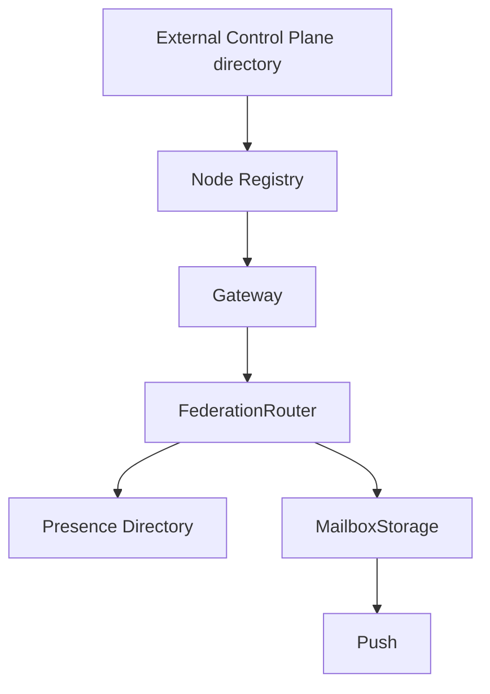
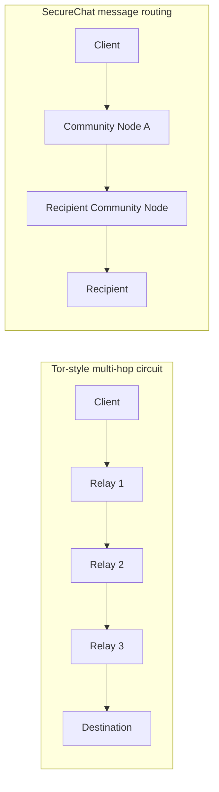

# What makes SecureChat different?

SecureChat is not trying to win by claiming that its cipher is magically stronger than every established messenger.
Its main difference is **where trust and availability live**.

Most mainstream encrypted messengers combine excellent end-to-end encryption with a provider-operated service.
SecureChat keeps end-to-end encryption on the clients too, but additionally splits the server side into multiple
Control Planes and independently hostable Community Nodes. A client can discover several authorized nodes, attach
to one of them, and move to another when the current node disappears.

That produces a different security and resilience profile.

!!! warning "Not a blanket claim that SecureChat is safer than Signal"
    Signal is a mature, widely deployed secure messenger with a highly developed cryptographic protocol and
    metadata-reduction work such as Sealed Sender. SecureChat is still an experimental project, has not had a
    completed independent security audit, and currently has a usable Android client only.

    The useful claim is narrower: **SecureChat can reduce some risks created by concentrating routing,
    availability, and infrastructure control in one service operator.** It does not currently have stronger
    evidence of cryptographic safety than Signal.

## The key idea: encrypted messaging without one mandatory messaging backend

The exact SecureChat pieces are implemented by classes such as:

- `HttpControlPlaneDirectorySynchronizer` — loads the external Control Plane directory;
- `SignedDirectoryControlPlaneCandidateVerifier` — verifies Control Plane candidates;
- `HttpNodeDirectorySource` / `NodeDirectoryVerifier` — obtains and verifies signed Community Node descriptors;
- `DefaultTransportConnectionManager` — selects/reconnects/fails over between nodes;
- `FailedNodeTracker` — keeps temporarily failed nodes out of immediate reselection;
- `DefaultWebSocketTransportClient` — maintains the client WebSocket to `/v1/gateway`;
- `NodeRegistrationAgent` — registers/heartbeats a Community Node against reachable Control Planes;
- `FederationRouter` and `FederationPeerRouter` — route encrypted envelopes between nodes;
- `MailboxStorage` / `PostgresMailboxStore` — store offline encrypted envelopes.

No individual Community Node is intended to become the permanent home of a user's account.

## Why this can be safer against some infrastructure threats

### 1. No single Community Node is mandatory

If one Community Node is shut down, unreachable, overloaded, or operated badly, clients can select another healthy
node. `DefaultTransportConnectionManager` and the node directory/failure tracking code are designed around this
assumption.

This reduces the blast radius of a **single routing-node failure or compromise**.

It does **not** make denial of service impossible. An attacker that can block every reachable node or every trusted
Control Plane can still prevent communication.

### 2. Community Nodes can be operated independently

The Community Node package is deliberately deployable by people other than the original project operator.
Nodes register themselves and advertise signed descriptors instead of requiring every user to connect to one
hardcoded server URL.

That makes the network more resistant to:

- one hosting-provider outage;
- one node operator disappearing;
- one server IP being blocked;
- one routing host becoming overloaded;
- a single operational mistake taking down all message transport.

The more genuinely independent operators and networks exist, the more meaningful this property becomes.
Running ten nodes on one account in one datacenter does not provide the same independence.

### 3. Control and message transport are separated

A Control Plane provides discovery, presence and Android push support. Community Nodes handle client WebSockets,
federation and mailboxes.

That split means the service responsible for publishing node information is not automatically the service carrying
every client connection and every encrypted envelope.

The important server classes reflect that boundary:

### 4. Message content stays client-side

Normal encrypted Direct and Group messages are encrypted before server transport. Gateway, federation and mailbox
services work with encrypted protocol payloads/envelopes rather than chat plaintext.

Client-side implementations include:

- `SodiumTransportMessageCipher` for sealed-box Direct transport payloads;
- `SodiumGroupCrypto` and `GroupSecurityManager` for Group content/key handling;
- `SodiumDetachedSignatureCrypto` for detached signatures;
- `AndroidPrivateKeyStorage` for Android private-key protection at rest.

A compromised routing server can still drop, delay, replay where checks allow, or observe metadata, but normal
message confidentiality is not supposed to depend on trusting that server with plaintext.

### 5. Offline storage is not a reason to give the server plaintext

Recipient-selected mailboxes store encrypted envelopes. The mailbox capability controls access to the mailbox;
it is not a decryption key for the chat content.

This keeps "recipient is offline" from changing the fundamental message-content trust boundary.

## Is it like Tor?

**There is a useful similarity, but SecureChat is not Tor.**

The similarity is the infrastructure philosophy:

- multiple independently operated relays/nodes;
- clients should not depend permanently on one relay;
- losing one relay should not destroy the whole network;
- community-operated infrastructure can make blocking or shutdown harder.

Tor goes much further. Tor is an anonymity network: traffic is deliberately sent through a multi-hop circuit of
relays with layered onion encryption. The Tor Project describes the normal Tor Browser path as three relays.
SecureChat currently connects a client to **one Community Node at a time**; that node may federate an encrypted
envelope to another node for the recipient.

Therefore SecureChat **must not be described as providing Tor anonymity**. Community Nodes and Control Planes can
still observe protocol metadata such as connection IPs/timing, routing activity, envelope sizes and load.

## SecureChat vs Signal vs WhatsApp vs Tor

| Property | SecureChat | Signal | WhatsApp | Tor |
|---|---|---|---|---|
| Primary purpose | Federated E2EE messaging | Private E2EE messaging | Large-scale E2EE messaging | Network anonymity/privacy |
| Message E2EE | Yes, current project crypto | Yes | Yes | Not a messaging protocol itself |
| Infrastructure model | Multiple Control Planes + independently hostable Community Nodes | Signal-operated service with strong metadata-minimization design | Meta-operated client/server service | Thousands of independently operated relays |
| Automatic relay/node failover | Yes, between authorized Community Nodes | Service implementation detail, not a user-operated federation model | Service implementation detail, not a user-operated federation model | Yes, circuits use multiple relays |
| Community can run transport nodes | Yes | Not as one shared federated Signal network | No | Yes |
| Multi-hop onion routing | No | No | No | Yes |
| Designed for sender/network anonymity | No | Metadata minimization, but not Tor-style anonymity | No | Yes |
| Cryptographic/protocol maturity | Experimental; no completed independent audit | Very high/mature | Very high; Signal Protocol is a foundation of WhatsApp E2EE | Very high for its anonymity-network threat model |
| Current SecureChat limitation | Android usable; iOS incomplete | Mature multi-platform product | Mature multi-platform product | Different product category |

## So is SecureChat "safer" than Signal or WhatsApp?

The answer depends on **which threat you mean**.

SecureChat can have an architectural advantage when the threat is:

- one company/operator controlling every routing server;
- a single messaging backend being shut down or blocked;
- one node or hosting provider becoming unavailable;
- wanting to operate or choose independent transport infrastructure;
- limiting how much trust is placed in any one routing node for message content.

Signal currently has a major advantage when the threat is **cryptographic implementation/protocol risk**:
its protocol, clients and privacy mechanisms have had far more deployment, expert scrutiny and hardening.
Signal also deliberately minimizes retained service metadata and implements Sealed Sender to reduce what the
service learns about message senders.

WhatsApp also provides end-to-end encryption by default and Meta states that the Signal Protocol is a foundational
piece of its encryption. SecureChat's differentiator is therefore **not "WhatsApp has no encryption"**. The
difference is primarily that SecureChat is designed to let message transport be spread across independently
operated nodes rather than one provider's infrastructure.

A fair description today is:

> **SecureChat trades some of the maturity of established messengers for a federated, independently hostable
> transport architecture intended to reduce central infrastructure dependence while keeping message content
> end-to-end encrypted.**

## What SecureChat does not protect against yet

Do not infer guarantees that the current architecture does not provide:

- it is not an anonymity network;
- a global observer may still correlate timing/traffic;
- infrastructure can observe some connection and routing metadata;
- a compromised client device defeats client-side confidentiality;
- a malicious server can still disrupt availability;
- the external Control Plane directory and signing/trust chain remain important bootstrap/trust inputs;
- the project has not completed an independent security audit;
- iOS is not currently a usable/supported client.

See [Threat model](security/threat-model.md), [Security overview](security/overview.md),
[Server overview](server/overview.md), and [Chats architecture](architecture/chats.md) for the detailed boundaries.

## External references for the comparison

These links describe the other systems in their own maintainers' words:

- [Signal: Sealed Sender](https://signal.org/blog/sealed-sender/)
- [Signal Protocol documentation](https://signal.org/docs/)
- [WhatsApp: About end-to-end encryption](https://faq.whatsapp.com/820124435853543)
- [Meta Engineering: WhatsApp and the Signal Protocol](https://engineering.fb.com/2024/03/06/security/whatsapp-messenger-messaging-interoperability-eu/)
- [Tor Project: How Tor works](https://support.torproject.org/about-tor/how-tor-works/overview/)
- [Tor specification: short introduction](https://spec.torproject.org/intro/index.html)
